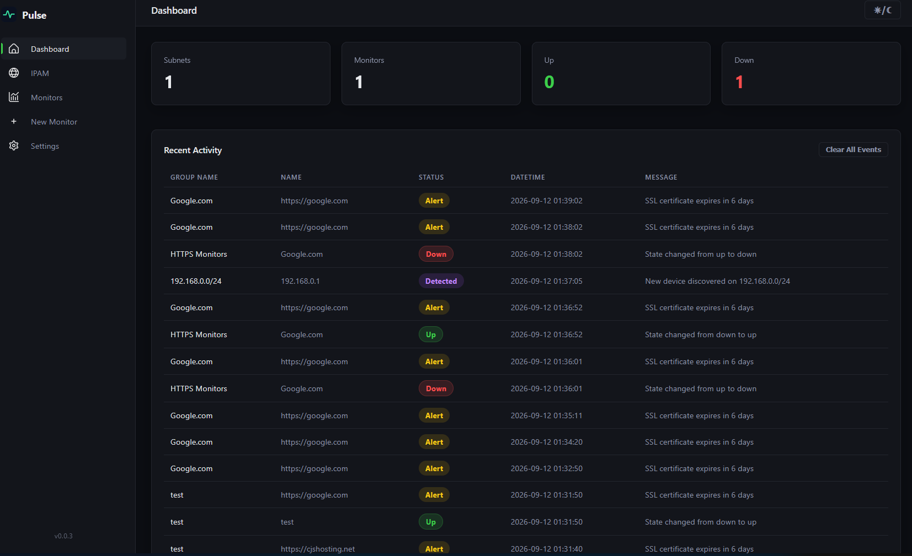
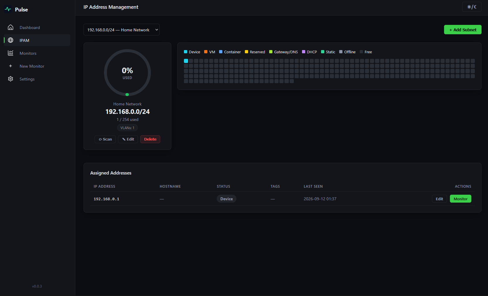
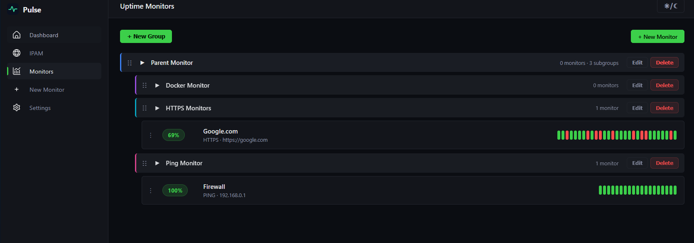
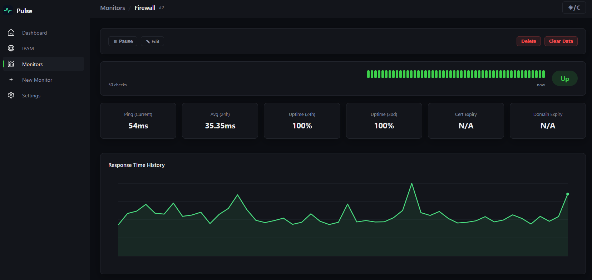
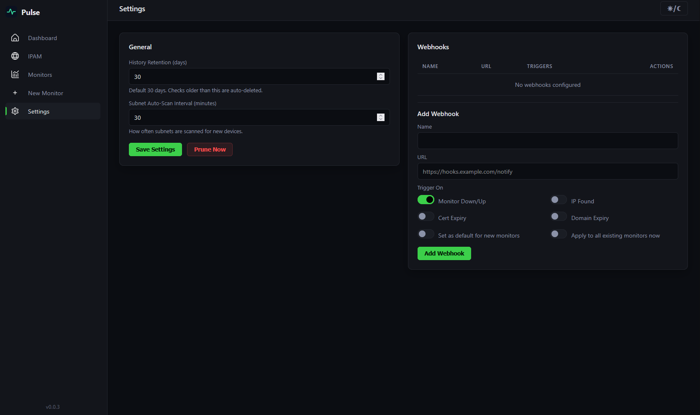

<p align="center">
  
</p>

<h1 align="center">Pulse</h1>
<p align="center">
  <b>A modern, self-hosted IPAM & Uptime Monitor</b><br>
  Lightweight · Docker-ready · Dark/Light mode · Real-time heartbeats
</p>

<p align="center">
  
  
  
  
</p>

---

## 🚀 Quick Start

### Docker (Recommended)

```
FROM python:3.13-slim

# Prevent Python from writing pyc files and buffering stdout
ENV PYTHONDONTWRITEBYTECODE=1 \
    PYTHONUNBUFFERED=1

WORKDIR /app

# Install dependencies first (better layer caching)
COPY requirements.txt .
RUN pip install --no-cache-dir -r requirements.txt

# Copy application code
COPY ./Pulse .

# Expose Flask port
EXPOSE 5000

# Run the app
CMD ["python", "app.py"]
```
```
services:
  pulse:
    container_name: pulse
    image: pulse:latest
    restart: unless-stopped
    ports:
      - "5000:5000"
    volumes:
      - db:/app/instance
      - /var/run/docker.sock:/var/run/docker.sock:ro
    environment:
      - FLASK_ENV=production
      
volumes:
  db:
```

---

## 📖 Features

**IP Address Management (IPAM)**
- Flat subnet architecture with visual square-grid utilization maps
- Circle/donut charts showing subnet usage with color-coded thresholds
  - Green (< 75%), Yellow (75–90%), Red (90%+)
- Auto-discovery scanning with ICMP + TCP fallback for VPN/Tailscale networks
- Hostname tracking, tags, VLAN notes, and manual IP assignment
- Automatic cleanup: IPs marked offline after 1 missed scan, deleted after 5 misses

**Uptime Monitoring**
- Multiple check types: **Ping**, **HTTP**, **HTTPS**, **Docker Container**
- Configurable heartbeat intervals, timeouts, and retry logic with degraded states
- Live updating status pills and uptime bar strips without page refresh
- Rich detail view: response time history, averages, cert expiry, domain expiry
- Instant check on monitor creation

**Grouping & Organization**
- Hierarchical monitor groups with nested subgroups
- Per-group color coding
- Drag-and-drop sorting for both groups and monitors (persisted to database)

**Notifications & Webhooks**
- Custom webhook destinations with test button
- Trigger types: Monitor Down/Up, IP Found, Certificate Expiry, Domain Expiry
- Default webhook assignment for new monitors
- Optional backfill to existing monitors

**Dashboard & Activity**
- Live event feed showing monitor state changes, new device discoveries, and expiry alerts
- Auto-pruning of old check data with configurable retention
- Responsive dark/light theme toggle

**Docker & Deployment**
- Single-container deployment with official Python slim image
- Docker Compose with persistent SQLite volume
- Auto-migration script (no database deletion on updates)
- One-command build script with Git metadata injection

---

## 📸 Screenshots
<p align="center">
  
</p>

<p align="center">
  
</p>

<p align="center">
  
</p>

<p align="center">
  
</p>

<p align="center">
  
</p>


---